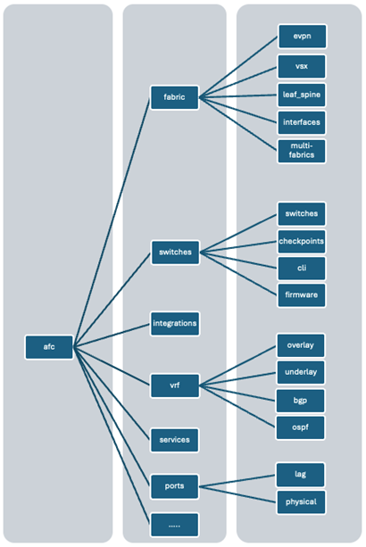

# pyafc

## Table of contents

- [pyafc](#pyafc)
  - [Table of contents](#table-of-contents)
  - [Overview](#overview)
  - [Design drivers](#design-drivers)
    - [Modules](#modules)
    - [Materialized objects](#materialized-objects)
    - [Class diagram](#class-diagram)
    - [Operations](#operations)
      - [Get](#get)
      - [Create](#create)
      - [Update](#update)
        - [Notifications](#notifications)
      - [Set](#set)
    - [Session management](#session-management)

## Overview

The pyafc (a.k.a. AFC Python SDK) is a framework created to ease the access to the Aruba Fabric Composer, using the REST API interface. The framework is not intended to be a Network Management System (NMS). Instead, it is meant to provide functions and classes to perform basic operations on the fabric composer including below operations:

1. Handling the session and remote connection.
1. Handling the allowed operations depending on their capabilities.
1. Parse and attend the responses depending on the API version.
1. Basic data validation.
1. Raising meaningful errors.

And, also, if needed:

1. Caching data.
1. Handling notifications.

## Design drivers

pyafc uses the object-oriented approach. Instead of having separate modules to perform specific operations, it connects several features together to represent the operational state of the fabric composer. Such pattern allows the client to keep track of the switch configuration in its internal data structures.

Every single feature must be represented in a class. Such a class may or may not be contained in another class or a collection.

### Modules

Each pyafc module is defined as a Python Class, in which it contains method definitions to generate and manage a module through REST API call or multiple REST API calls. All module creation is managed through a flag attribute materialized. This attribute will be `True` if the module exists within the device, `False` otherwise. This will be updated whenever a POST or GET called is done.

### Materialized objects

The attributes for a local object in the SDK may not match the current configuration on the switch. Creating a local object in the SDK does not mean the object was created in  the device. The internal attributes can be filled with _artificial_ data, which cannot be considered _materialized_ unless the object was retrieved from the device with a __get__ operation, or the object was created with the operation __create__.

### Class diagram

### Operations

REST API allows a well-known list of HTTP verbs. They must be mapped to class-specific operations to keep the same behavior along this SDK.

#### Get

This method maps to the HTTP GET verb. It allows to retrieve the data from the device, converting the JSON response into the corresponding internal attributes of the object. Object attributes must match 1:1 with the device information.

#### Create

This method maps to the HTTP POST verb. It retrieves a list of attributes from the object known as writable attributes, creating a body for the POST request.

#### Update

This method maps to the HTTP PUT verb. Just as the previous method, it retrieves a list of attributes from the object known as writable attributes. The difference is the UPDATE methods makes a PUT Request. It's important to know that this method is executed only if the object is materialized.

##### Notifications

To be supported in upcoming releases.

#### Set

Given that the REST API does not provide support to the HTTP PATCH verb yet, all the operations to change the device configuration must use the HTTP PUT verb. It means that the original attributes must be retrieved first, then change the values required, and finally perform the change. This operation cannot be performed on an unmaterialized object.

### Session management

In order to perform any operation in the device, a connection must be established. The session is an object representing it. It keeps the credential information, such as `username` and `password`, and, once established, it also keeps the session cookie. There is an assumption that all the operations performed should be done with the same REST API version. Therefore, the session also contains the version the client wants to use. 

The session state must be validated every time an operation must be performed. A Python decorator came to help to validate the connection status and establish it if required.

However, in order to prevent using a _global accessible object_ representing the session, and passing it as a parameter in every call, the SDK objects may receive the session object as _mandatory parameter_ in the constructor.
